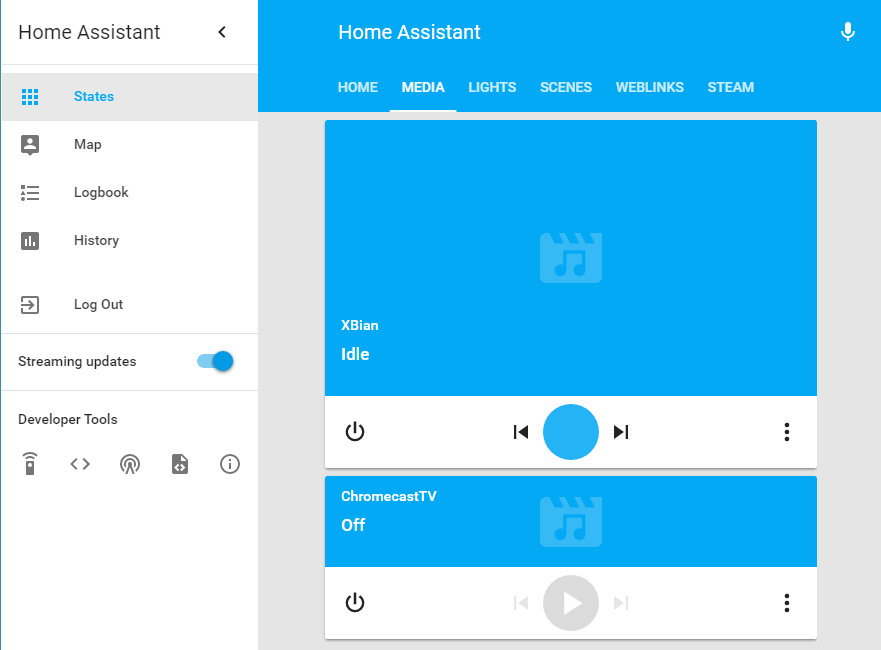
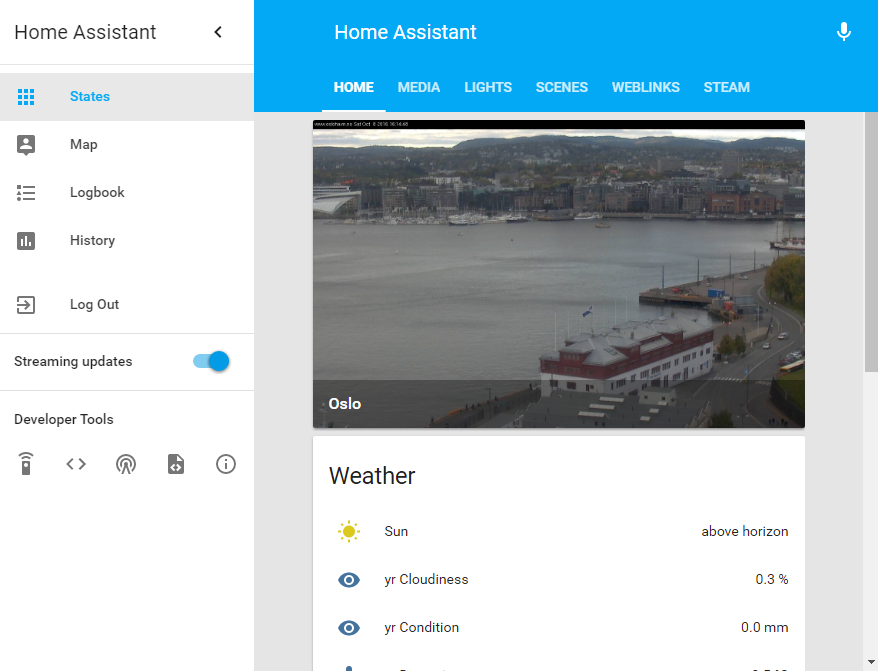
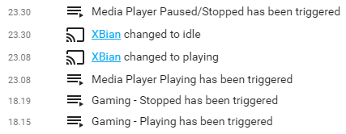

# HA (HomeAssistant)

This is the redacted version of my HomeAssistant setup

## Todo-list
- [ ] Add Hue Motion Sensor to config.
- [ ] Make detailed guide for how to use State attributes for Steam using templates.
- [ ] Further expand triggers for Steam based on gametitles.
- [ ] Expand even more by adding curl-pull for game features (i.e. co-op supported games).
- [ ] Decide if using a locally-hosted features-library based on steam-library would be faster. If so, use JSON-format.
- [ ] Add sensors from Z-Wave (Window and door-sensors, check if open/closed).
- [ ] Make security-setup based on motion-sensors and window/door-sensors.

## Experimental Todo-list
- [ ] LED-grid triggered by steam profiles, set colors by game-title.
- [ ] Expand LED-grid to include curl-pulled featureslist for games (i.e. co-op games).

## Screenshots
#### The Media-tab

Status and controls for xBian (Kodi) and not much used Chromecast after I started using xBian.
#### The Home-tab

The first screen to check the weather and travel-options. Last part not integrated yet.
#### Triggers logbook

Example of triggers working from the logbook
